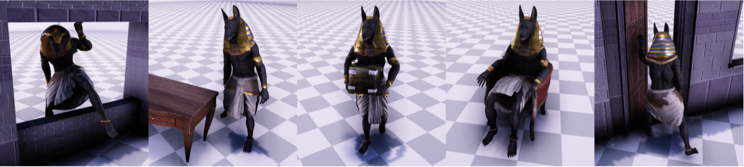

# CASAC
Character animation synthesis and control

Character animation synthesis based on Transformer. Try to improve [Neural State Machine for Character-Scene Interactions](https://www.ipab.inf.ed.ac.uk/cgvu/nsm.pdf) 

## Dataset

Data export Using Github Project  [Neural State Machine for Character-Scene Interactions](https://github.com/sebastianstarke/AI4Animation/tree/master/AI4Animation/SIGGRAPH_Asia_2019) 

## Requirement

```
python==3.6
torch==1.5
cuda==8.0
```
## Step

1. utils/data_preprocess.py is the script for data preprocessing, which splits and normalizes the original data.
```shell script
python util/data_preprocess.py --data_root </origin data dir> --output_root </your data dir> --scale 0.1
```
2. main.py is the entrance of training model and test model.
```shell script
python main.py --epoch 200 --lr 0.0001 --data_len 10 --batch_size 4 --data_root </your data dir>  \
    --save_path </your save model dir>  --train
```
## Other

model/bert/config.py is the configuration file of model neural network layer parameters.

model/bert/model.py is the basic framework of the model.

draw/draw_loss.py is the script for drawing the loss curve.

network is the specific neural network model.

Sever/socket_server.py is the socket server script that communicates with unity.

## Result

Our Carry improve:


NSM Carry:

